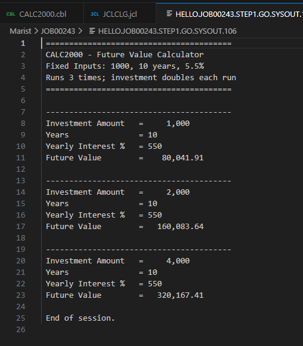
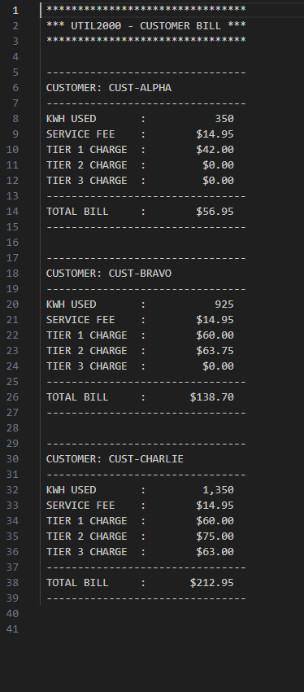
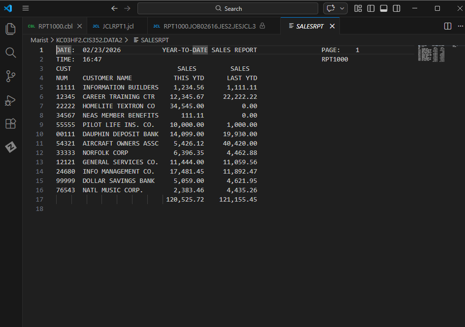
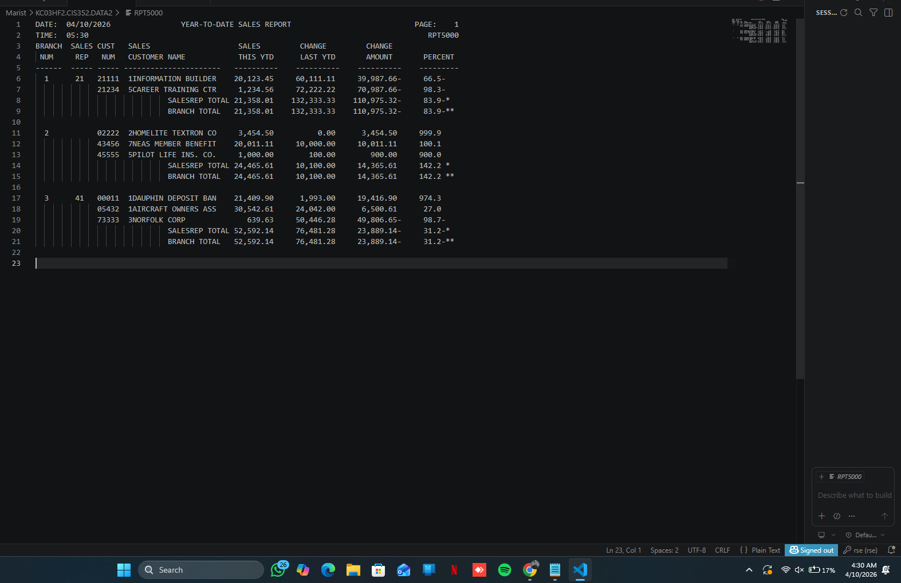
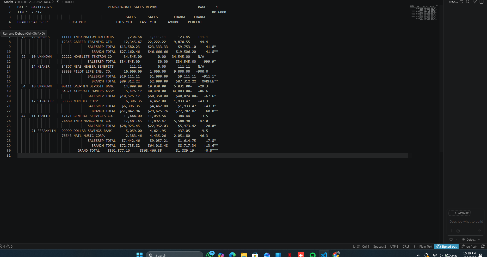

# 💼 Developer Portfolio Gateway  
**Author:** Dhruv Patel  
**Course:** CIS 352 – Intro to Enterprise Computing  

---

## 👋 About Me

**Welcome to my GitHub portfolio repository!**

I am currently studying Computer Information Systems at Wayne State College.  
This repository serves as a central hub for my coursework and COBOL projects developed throughout CIS 352.

These projects demonstrate enterprise programming concepts including report generation, file maintenance, table processing, indexed files, and structured COBOL program design.

---

## 📸 Profile

  

<h3 align="center">Dhruv Patel</h3>

  <a href="https://github.com/dhruvpatel21072002-art">GitHub</a>

---

## 📚 Table of Contents

| Project Summary | Tech | Category | Description | Repo |
|---------|------|----------|-------------|------|
| [CALC2000](#calc2000) | COBOL / JCL | Intro to Enterprise Computing | Calculates future investment values using compound interest logic | [CALC2000](https://github.com/dhruvpatel21072002-art/cobol-calc2000) |
| [UTIL2000](#util2000) | COBOL / JCL | Intro to Enterprise Computing | Calculates monthly utility bills using tiered kWh billing logic | [UTIL2000](https://github.com/dhruvpatel21072002-art/COBOL-UTIL1000) |
| [RPT2000](#rpt2000) | COBOL / JCL | Intro to Enterprise Computing | Generates formatted YTD sales reports with comparison calculations | [RPT2000](https://github.com/dhruvpatel21072002-art/COBOL-RPT2000) |
| [RPT5000](#rpt5000) | COBOL / JCL | Intro to Enterprise Computing | Produces advanced YTD sales reports with multi-level control breaks | [RPT5000](https://github.com/dhruvpatel21072002-art/REDORPT5000/tree/main) |
| [RPT6000](#rpt6000) | COBOL / JCL | Intro to Enterprise Computing | Advanced reporting system with indexed tables and COPYLIB usage | [RPT6000](https://github.com/C0rinth1an/RPT6000) |
| [SEQ3000](#seq3000) | COBOL / JCL | Intro to Enterprise Computing | Maintains employee records using add, update, and delete operations | [SEQ3000](https://github.com/dhruvpatel21072002-art/SEQ3000) |

---

## CALC2000

A `COBOL` program that calculates the future value of an investment using compound interest calculations.

This project demonstrates structured COBOL programming using modular paragraphs, PERFORM statements, and formatted numeric output.

**Key Concepts:** Compound interest | PERFORM loops | COMPUTE statements | Numeric formatting | Structured paragraph design

**Tech Stack:**  

✅ Completed  
[CALC2000 Repo](https://github.com/dhruvpatel21072002-art/cobol-calc2000)

🔙 [Back to TOC](#-table-of-contents)

---

## UTIL2000

A `COBOL` utility billing system that calculates monthly electricity bills for multiple customers using a tiered kilowatt-hour billing structure.

**Key Concepts:** Tiered billing | Conditional logic | COMPUTE with ROUNDED | Edited numeric formatting | PERFORM structure

**Tech Stack:**  

✅ Completed  
[UTIL2000 Repo](https://github.com/dhruvpatel21072002-art/COBOL-UTIL1000)

🔙 [Back to TOC](#-table-of-contents)

---

## RPT2000

A `COBOL` reporting program that processes customer sales records and generates a formatted Year-To-Date Sales Report.

The report compares current and previous year sales while calculating differences and percentage changes.

**Key Concepts:** Sequential file processing | Report formatting | Percent calculations | Data aggregation | YTD comparison

**Tech Stack:**  

✅ Completed  
[RPT2000 Repo](https://github.com/dhruvpatel21072002-art/COBOL-RPT2000)

🔙 [Back to TOC](#-table-of-contents)

---

## RPT5000

An advanced `COBOL` reporting system that processes customer sales data and generates a multi-level Year-To-Date Sales Report.

This project calculates sales changes, percentage changes, SalesRep totals, Branch totals, and Grand totals using control break logic.

**Key Concepts:** Control breaks | EVALUATE | PERFORM UNTIL | Accumulators | COMPUTE with ROUNDED | Report formatting

**Tech Stack:**  

✅ Completed  
[RPT5000 Repo](https://github.com/dhruvpatel21072002-art/REDORPT5000/tree/main)

🔙 [Back to TOC](#-table-of-contents)

---

## RPT6000

An advanced `COBOL` reporting system that processes customer and sales representative data to generate a detailed Year-To-Date Sales Report.

This project expands on previous reporting systems by introducing table processing, indexed lookups, COPYLIB usage, and advanced formatting logic.

**Key Concepts:** REDEFINES | OCCURS tables | Indexed access | COPY statements | Table lookup logic | Packed decimal calculations

**Tech Stack:**  

✅ Completed  
[RPT6000 Repo](https://github.com/C0rinth1an/RPT6000)

🔙 [Back to TOC](#-table-of-contents)

---

## SEQ3000

A `COBOL` file maintenance project that processes employee master records and transaction records.

This project performs add, change, and delete operations using sequential file maintenance and indexed file processing.

**Key Concepts:** Sequential processing | Merge logic | Indexed files | Random access | Error handling | File maintenance

**Tech Stack:**  

✅ Completed  
[SEQ3000 Repo](https://github.com/dhruvpatel21072002-art/SEQ3000)

🔙 [Back to TOC](#-table-of-contents)

---

## 🚀 Portfolio Summary

This portfolio highlights my experience with enterprise computing and COBOL programming throughout CIS 352.

Through these projects, I gained hands-on experience with:

- Structured COBOL programming
- Sequential and indexed file processing
- Report generation and formatting
- Table handling and indexed access
- Control break logic and accumulators
- JCL compilation and execution
- IBM Mainframe development workflow

These assignments strengthened my understanding of enterprise-level application development and data processing techniques commonly used in mainframe environments.

---
